<p align="center">
  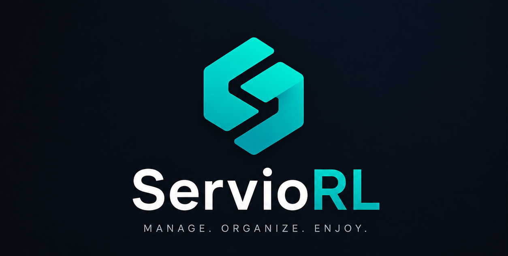
</p>

<p align="center">
  <strong>Personal Media Server Manager for Android</strong><br/>
  Manage your entire media stack from one place — via Tailscale
</p>

<p align="center">
  
  
  
  
  
  
</p>

> ⚠️ **This app is currently under active development.** Features may be incomplete, APIs may change, and bugs are expected. Use at your own risk. Contributions and feedback are welcome!

---

## Overview

<p align="center">
  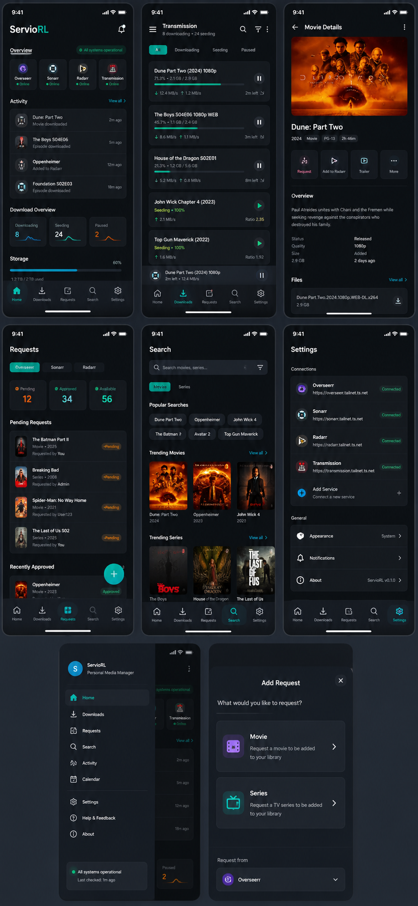
</p>

ServioRL connects to your home media server via **Tailscale** and gives you full control over:

| Service | What you can do |
|---|---|
| 🔍 **Seerr** | Search & request movies / series |
| 🎬 **Radarr** | Browse library, interactive search, grab releases |
| 📺 **Sonarr** | Browse series, per-episode search, grab releases |
| ⬇️ **Transmission** | Monitor torrents, stop / start / remove |
| 💬 **Bazarr** | Find & download missing subtitles |

---

## Screenshots

<table>
  <tr>
    <td align="center">
      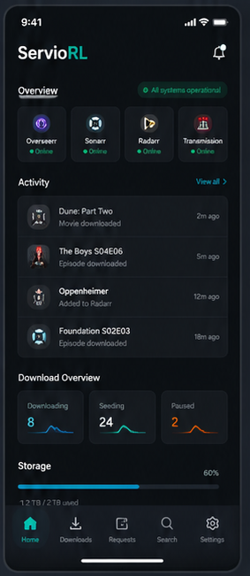<br/>
      <sub><b>Home Dashboard</b></sub>
    </td>
    <td align="center">
      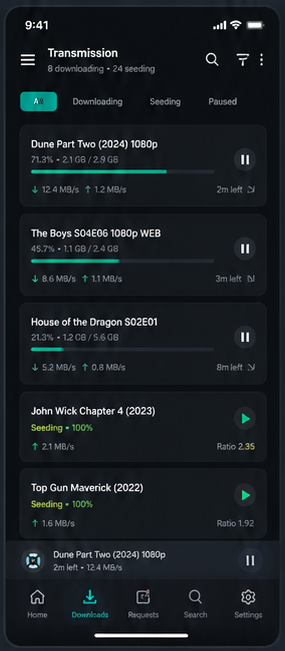<br/>
      <sub><b>Downloads</b></sub>
    </td>
    <td align="center">
      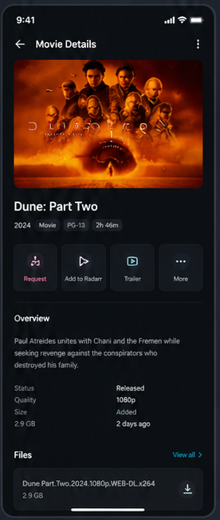<br/>
      <sub><b>Requests</b></sub>
    </td>
    <td align="center">
      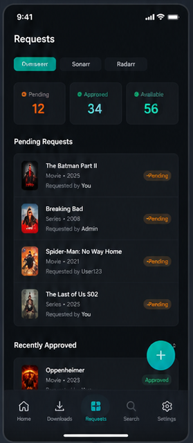<br/>
      <sub><b>Search</b></sub>
    </td>
  </tr>
  <tr>
    <td align="center">
      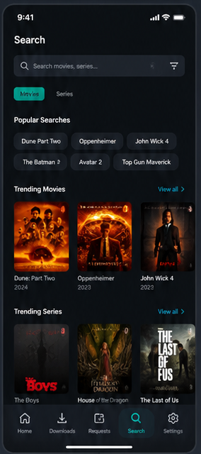<br/>
      <sub><b>Movies (Radarr)</b></sub>
    </td>
    <td align="center">
      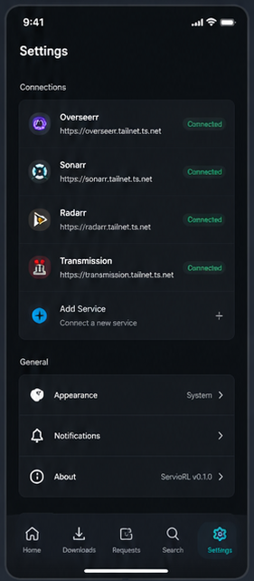<br/>
      <sub><b>TV Series (Sonarr)</b></sub>
    </td>
    <td align="center">
      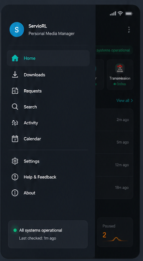<br/>
      <sub><b>Subtitles (Bazarr)</b></sub>
    </td>
    <td align="center">
      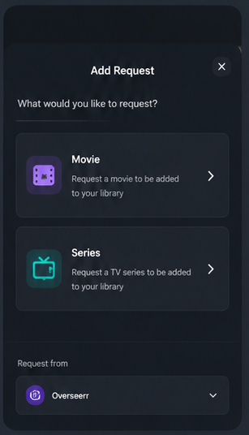<br/>
      <sub><b>Settings</b></sub>
    </td>
  </tr>
</table>

---

## Features

### 🏠 Home Dashboard
- Service status cards with online indicator
- Recent activity feed
- Download overview — Downloading / Seeding / Paused
- Storage usage bar

### ⬇️ Downloads — Transmission
- Tab filter: **Downloading / Seeding / Paused**
- Progress bar with speed ↓↑, size, ETA
- **Stalled** badge (red) when peers = 0
- Pause / Play / Remove with "Delete files" option

### 📋 Requests — Seerr
- Tab filter: **Seerr / Sonarr (TV) / Radarr (Movies)**
- Count cards: Pending / Approved / Available — tap to filter
- TMDB poster, title, year, requested by, time ago
- Status badge per request

### 🔍 Search — Seerr
- Search bar with **Movies / Series** toggle
- Popular search chips
- Trending Movies + Trending Series grid
- Inline **Request** button
- Detail bottom sheet with backdrop, overview, rating

### 🎬 Movies — Radarr
- 3-column poster grid with quality badge + Missing overlay
- Filter: All / Downloaded / Missing / Monitored
- Sort: Title / Year / Size / Rating
- Movie detail: fanart header, genres, overview
- **Auto Search** + **Interactive Search**
- Interactive Search: quality, size, seeders — one-tap **Grab**

### 📺 TV Series — Sonarr
- 3-column poster grid with episode progress bar + **ON AIR** badge
- Filter: All / Airing / Ended / Missing / Monitored
- Series detail with expandable seasons
- Per-episode **Interactive Search** with Grab button

### 💬 Subtitles — Bazarr
- Missing subtitles list (movies + episodes)
- Filter: All / Movies / Episodes
- **Auto Search** per item
- **Manual Search**: language picker → subtitle results
- Score badge, provider, HI flag — one-tap **Download**

### ⚙️ Settings
- Expandable service tiles — Connected / Setup badge
- Seerr / Sonarr / Radarr / Transmission / Bazarr
- General: Appearance, Notifications, About

---

## Requirements

| Requirement | Minimum |
|---|---|
| Android | **5.0 (API 21)** or higher |
| Android recommended | 8.0 (API 26) or higher for best experience |
| RAM | 2 GB |
| Tailscale | Installed & connected on your Android device |

---

## Build APK

### 1. Install Flutter

Download Flutter SDK from [flutter.dev](https://flutter.dev/docs/get-started/install) and follow the install guide for your OS (Windows / macOS / Linux).

Verify installation:
```bash
flutter doctor
```
Make sure there are no critical errors — Android toolchain must be ✅.

### 2. Clone & install dependencies

```bash
git clone https://github.com/bugsdroid/ServioRL.git
cd ServioRL
flutter pub get
```

### 3. Build APK

**Debug APK** (for quick testing, larger file size):
```bash
flutter build apk --debug
```

**Release APK** (optimized, smaller, recommended for daily use):
```bash
flutter build apk --release
```

**Split APK per architecture** (smallest file size, pick one for your device):
```bash
flutter build apk --split-per-abi --release
```
This generates 3 files — pick the right one for your phone:
- `app-arm64-v8a-release.apk` → most modern Android phones (64-bit)
- `app-armeabi-v7a-release.apk` → older 32-bit phones
- `app-x86_64-release.apk` → emulators / Intel-based devices

### 4. Find the APK

After build, APK files are located at:
```
ServioRL/build/app/outputs/flutter-apk/
```

### 5. Install on your phone

**Option A — via USB:**
```bash
# Enable USB Debugging on your phone first
# Settings → Developer Options → USB Debugging → ON
flutter install
```

**Option B — manual transfer:**
1. Copy the `.apk` file to your phone (via USB, Google Drive, WhatsApp, etc.)
2. On your phone: open the APK file
3. If prompted, enable **"Install from unknown sources"** for your file manager
4. Tap **Install**

**Option C — via ADB:**
```bash
adb install build/app/outputs/flutter-apk/app-release.apk
```

> 💡 **Tip:** For daily use, the `--split-per-abi --release` build gives the smallest APK. Most modern phones use `arm64-v8a`.

---

## Service Setup

Open the app → **Settings** → tap each service to expand and fill in:

| Service | Default Port | Auth |
|---|---|---|
| Seerr | 5055 | API Key |
| Sonarr | 8989 | API Key |
| Radarr | 7878 | API Key |
| Transmission | 9091 | Username + Password (optional) |
| Bazarr | 6767 | API Key |

> All services are accessed directly via **Tailscale IP** — no reverse proxy or port forwarding needed.

---

## Tech Stack

| Package | Purpose |
|---|---|
| [flutter_riverpod](https://pub.dev/packages/flutter_riverpod) | State management |
| [dio](https://pub.dev/packages/dio) | HTTP client |
| [go_router](https://pub.dev/packages/go_router) | Navigation |
| [shared_preferences](https://pub.dev/packages/shared_preferences) | Config persistence |
| [cached_network_image](https://pub.dev/packages/cached_network_image) | TMDB poster caching |

---

## Project Structure

```
lib/
├── main.dart
├── core/
│   ├── config/        # AppConfig + Riverpod provider
│   ├── network/       # Dio clients + Transmission RPC client
│   ├── router/        # go_router setup
│   └── theme/         # Dark theme + AppColors
└── features/
    ├── home/          # Dashboard
    ├── downloads/     # Transmission
    ├── requests/      # Seerr requests
    ├── search/        # Seerr search & trending
    ├── movies/        # Radarr
    ├── tv/            # Sonarr
    ├── subtitles/     # Bazarr
    ├── settings/      # Config screen
    └── widgets/       # Shared widgets (logo)
```

---

## License

MIT — free to use and modify for personal use.

<p align="center">
  <br/>
  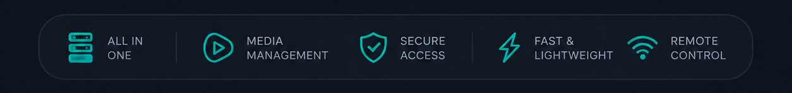
  <br/><br/>
  <sub>Built for personal media servers · Powered by Flutter</sub>
</p>
